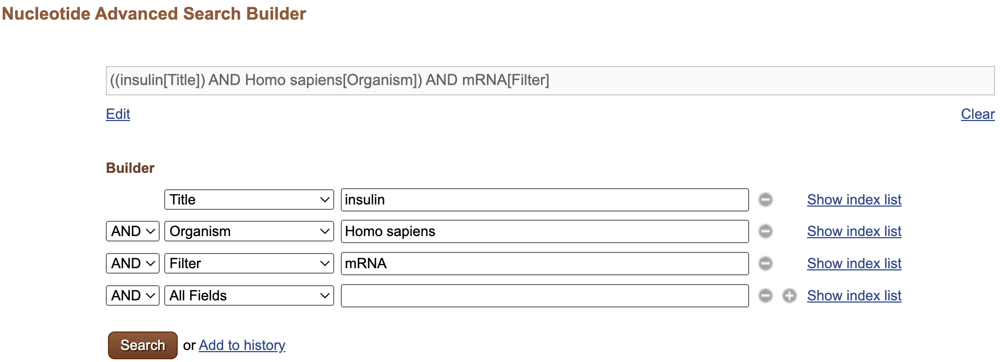

# NCBI

> Strona serwisu NCBI: https://www.ncbi.nlm.nih.gov

## Zad. 1
Wymień pięć przykładowych baz danych wchodzących w skład serwisu NCBI.

## Zad. 2
W bazie nukleotdyowej (*Nucleotide*) serwisu NCBI wyszukaj rekord sekwencji o numerze dostępu `AB001981`.


1. Jaki jest typ znalezionej sekwencji (DNA / mRNA / tRNA / białko)?
2. Podaj długość znalezionej sekwencji.
3. Z genomu jakiego organizmu pochodzi znaleziona sekwencja?
4. Ile genów zawiera znaleziona sekwencja?
5. Co oznaczają poniższe linie w rekordzie?

   ```
   CDS join(1104..1192,1306..1510,1614..1742)
   CDS join(4915..5009,5165..5369,5474..5602)
   ```

6. Ile referencji literaturowych dotyczy znalezionej sekwencji?
7. Wyświetl sekwencję rekordu w formacie FASTA i umieść w sprawozdaniu.
8. Wyświetl rekord sekwencji w formie graficznej (*Graphics*). 
    - Z ilu egzonów składają się geny alfa-globin?


## Zad. 3
W bazie nukleotydowej NCBI w jednym zapytaniu wyszukaj rekordy sekwencji dla poniższych 10 numerów dostępu.

```
XM_009313067
NM_001275793
NM_116919
XM_007825334
NM_023057
NM_070001
NM_020791
NM_001180785
XM_004367964
NM_001326476
```

Z której z poniższych rodzin genów pochodzą znalezione sekwencje?

1. alfa-globin
2. histonów H2A
3. metylotransferaz
4. kinaz


## Zad. 4
W bazie białkowej (*Protein*) serwisu NCBI znajdź białka szoku cieplnego wpisując w polu wyszukiwania `heat shock factor`. 

1. Ile rekordów zostało znalezionych?
2. Podaj zapytanie znajdujące się w polu `Search details`.
3. Ile z tych rekordów należy do bakterii?


## Zad. 5
Ponów wyszukiwanie, tym razem ujmując frazę `heat shock factor` w cudzysłów.

1. Ile rekordów zostało znalezionych?
2. Podaj zapytanie znajdujące się w polu `Search details`.
3. Ile z tych rekordów należy do bakterii?


## Zad. 6
Ile sekwencji mRNA insuliny człowieka znajduje się w nukleotydowej bazie NCBI?

W tym celu:
- Wybierz bazę nukleotydową (*Nucleotide*).
- W polu wyszukiwania wpisz `insulin` i naciśnij przycisk *Search*.
- Korzystając z filtrów po lewej stronie zawęź kryteria wyszukiwania do sekwencji mRNA.
- Korzystając z filtrów po prawej stronie zawęź kryteria wyszukiwania do sekwencji pochodzących z człowieka.


## Zad. 7
Korzystając z zaawansowanego wyszukiwania (*Advanced*) skonstruuj zapytanie do nukleotydowej bazy NCBI, aby znaleźć wszystkie sekwencje mRNA insuliny pochodzące z człowieka.

<p align="center">
  
</p>

1. Ile rekordów znaleziono?
2. Podaj użyte zapytanie (w polu *Search details*).
3. Zmodyfikuj użyte zapytanie, aby wykluczyć sekwencje, które mają w tytule frazy `insulin-like` lub `partial` lub `part`. Podaj użyte zapytanie.


## Zad. 8
Korzystając z zaawansowanego wyszukiwania białkowej bazy NCBI skonstruuj zapytanie, aby znaleźć sekwencje białkowe genu o nazwie BRCA2 pochodzące z człowieka i bazy *RefSeq*. 

1. Podaj użyte zapytanie.
2. Podaj numer dostępu znalezionych sekwencji białkowych.
3. Ile aminokwasów ma najdłuższa znaleziona sekwencja?
4. Otwórz rekord białkowy najdłuższej sekwencji. Podaj numer dostępu sekwencji mRNA kodującej to białko.
   > Wskazówka: pole `DBSOURCE`.

Przejdź do rekordu mRNA analizowanego białka BRCA2. 

5. Z ilu nukleotydów złożone jest mRNA?
6. Podaj identyfikator genu BRCA2 (*GeneID*).


## Zad. 9
Przejdź do strony rekordu genu BRCA2.

1. Z ilu egzonów zbudowany jest ten gen?
2. Na którym chromosomie znajduje się gen BRCA2?
3. Podaj pozycję początku i końca sekwencji genu na chromosomie.


## Zad. 10
Korzystając z zaawansowanego wyszukiwania znajdź w bazie *Gene* ludzki gen o nazwie *HFE*. 

1. Podaj użyte zapytanie.
2. Podaj identyfikator genu HFE w bazie Gene.
3. Z ilu egzonów składa się ten gen?
4. Ile wariantów splicingowych (transkryptów) ma ten gen?
   > Wskazówka: sekcja *mRNA and Protein(s)*.


## Zad. 11
Korzystając z bazy taksonomicznej (*Taxonomy*) serwisu NCBI wyszukaj wszystkie typy sekwencji dostępne dla wirusa SARS-CoV-2. 

1. Podaj identyfikator taksonomiczny SARS-CoV-2 (*Taxonomy ID*).
2. Ile sekwencji nukleotydowych dostępnych jest dla tego wirusa?
3. Podaj nazwę rodziny, do której należy wirus.
   > Wskazówka: Pole *Lineage*.

## Zad. 12
Korzystając z bazy taksonomicznej NCBI wyrzukaj rząd gryzoni (*Rodentia*). Następnie wyświetl drzewo taksonomiczne rozszerzając je do sześciu poziomów rozgałęzienia (*levels*). 

1. Do jakiej podrodziny należy rodzaj *Rattus*?

Ogranicz widok drzewa tylko do organizmów o znanych sekwencjach genomów (*using filter*). Dla każdej jednostki taksonomicznej na drzewie wyświetl liczbę genów, sekwencji białkowych i nukleotydowych. 

2. Ile sekwencji białkowych dostępnych jest dla szczura *Rattus norvegicus*?

# ENA - EMBL/EBI
> Strona serwisu ENA: https://www.ebi.ac.uk/ena/browser/home

## Zad. 13
Sprawdź, czy w serwisie ENA znajduje się rekord z zad. 2 o numerze dostępu `AB001981`. 

## Zad. 14
Korzystając z zaawansowanego wyszukiwania znajdź w bazie ENA wszystkie sekwencje mRNA pochodzące od wampira zwyczajnego (*vampire bat*).

- Z menu wybierz *Search* > *Advanced search*
- Ustaw `Data type` na *Nucleotide sequences*.
- Naciśnij przycisk *Next*.
- W `Taxonomy and related` > `NCBI Taxonomy` wpisz *vampire bat*
- W `Sequenced molecule` > `Molecule type` wybierz *mRNA*
- Naciśnij przycisk *Search*.

Ile rekordów zostało znalezionych?

## Zad. 15
W serwisie ENA wyszukaj wszystkie sekwencje wirusa SARS-CoV-2. 

- Z menu wybierz *Search* > *Advanced search*
- Ustaw `Data type` na *Nucleotide sequences*.
- Naciśnij przycisk *Next*.
- W `Taxonomy and related` > `NCBI Taxonomy` wpisz identyfikator taksonomiczny wirusa.
- Naciśnij przycisk *Search*.

Ile sekwencji znaleziono?