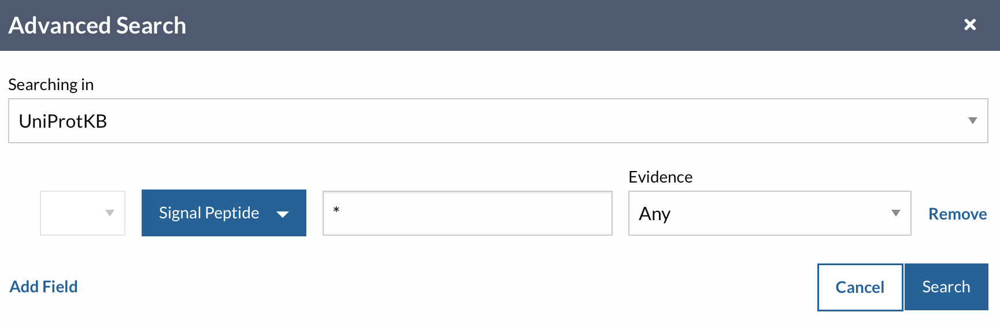

# UniProt

> Strona serwisu UniProt: https://www.uniprot.org


## Zad. 1
Otwórz stronę serwisu Uniprot. W polu wyszukiwania wpisz `human insulin`. Wyświetl wyniki w formacie tabeli.

1. Ile rekordów znaleziono?
2. Na którym miejscu na liście białek znajduje się szukana insulina człowieka (*protein name:* `insulin` i *gene name:* `INS`)?
3. W panelu po lewej stronie, w części `Popular organisms` wybierz `human`.
   - Ile rekordów zostało?
4. Na którym miejscu na liście białek znajduje się szukana insulina człowieka?
5. Skorzystaj z zaawansowanego wyszukiwania (*Advanced*) i wyszukaj białka człowieka, których nazwa zawiera `insulin`, ale nie `insulin-like`.
   - Ile rekordów zostało?
6. Na którym miejscu na liście białek znajduje się szukana insulina człowieka?
7. Ile rekordów pochodzi z bazy Swiss-Prot a ile z bazy TrEMBL?


## Zad. 2
Przejdź do rekordu sekwencji insuliny człowieka (numer dostępu: `P01308`). 

1. Jaka jest lokalizacja komórkowa insuliny (panel `Subcellular location`)?
2. Wymień trzy przykładowe procesy biologiczne i funkcje molekularne, w których uczestniczy insulina (`Function`)
2. Wymień trzy jednostki chorobowe związane z białkiem insuliny (`Disease & Variants`).
   - Podaj jeden wariant/polimorfizm sekwencji związany z hiperproinsulinemią.
3. Ile peptydów sygnałowych i propeptydów zawiera sekwencja insuliny? (`PTM / Processing`)  
   > Ta część rekordu zawiera informacje na temat post-translacyjnych modyfikacji (PTM) białka. Peptydy sygnałowe i propeptydy zostają usunięte z białka insuliny zanim białko zostanie wydzielone poza komórkę. Sekwencja dojrzałego białka insuliny składa się z łańcuchów białkowych A i B.
4. Wyświetl sekwencję białkową insuliny w formacie FASTA i umieść w sprawozdaniu (`Sequence & Isoform`).
5. Jaki jest numer dostępu białka i odpowiadającego mu mRNA w bazie RefSeq (`Sequence databases`)?
6. Wyświetl rekord insuliny w formacie tekstowym (`Download` > `Text`). Jak nazywa się ten format zapisu sekwencji?
   - FASTA
   - GenBank
   - XML
   - ASN.1
   - ENA/EMBL


## Zad. 3
W serwisie UniProt użyj zaawansowanego wyszukiwania aby znaleźć wszystkie białka posiadające peptydy sygnałowe.
> `Advanced > PTM/Processing > Molecule Processing > Signal Peptide`, w polu wyszukiwania wpisz `*`.



1. Ile białek znaleziono?
   * Podaj zapytanie do bazy danych.
2. Zawęź wyniki wyszukiwania do białek zawierających peptydy sygnałowe o doświadczalnie potwierdzonej funkcji (`Evidence` > `Experimental`). 
   * Ile białek znaleziono?
   * Podaj zapytanie do bazy danych.
3. Zawęź wyniki poprzedniego wyszukiwania do białek występujących u człowieka.
   * Ile białek znaleziono?
   * Podaj zapytanie do bazy danych.


## Zad. 4
Białko rycyna (*ricin*) pochodzące z rącznika pospolitego (*Ricinus communis*) posiada silne właściwości toksyczne, dlatego niejednokrotnie było wykorzystywane jako broń biologiczna. Znajdź rekord tego białka w bazie UniProt. 

1. Podaj numer dostępu znalezionego białka.
2. Jaka cząsteczka zostaje przerwana przez działanie rycyny? (panel `Function`)
3. Jaka mutacja w sekwencji aminokwasowej rycyny niweluje jej toksyczne działanie? (`Phenotypes & Variants`)

## Zad. 5
W serwisie UniProt wyszukaj wszystkie sekwencje białkowe, których długość nie przekracza 10 aminokwasów.

1. Podaj użyte zapytanie.
2. Ile białek znaleziono?
3. Bardzo krótkie białka są często błędami wynikającymi z automatycznej translacji sekwencji nukleotydowych. Korzystając z zaawansowanego wyszukiwania ogranicz wyniki do białek, dla których istnieją dowody na ich istnienie na poziomie białka (`Protein Existence [PE]`). Ile rekordów zostało?
4. Podaj długość najkrótszego białka oraz przykładowy numer dostępu.
5. Ile z tych białek występuje u człowieka?


## Zad. 6
Serwis UniProt umożliwia konwersję numerów dostępu białek między UniProt a innymi bazami danych. Ze strony głównej wybierz `ID mapping` i dokonaj konwersji poniższych pięciu numerów dostępu bazy UniProt na numery dostępu bazy NCBI RefSeq (`Refseq Protein`):

```
TNR6A_HUMAN
Q9UPQ9
Q9HCJ0
O94687
Q5D869
```

1. Dla ilu numerów dostępu UniProt udało się znaleźć białka w bazie RefSeq?
2. W sprawozdaniu umieść wynik konwersji (`Download` > `Format TSV`).


# Ontologia genów

## Zad. 7
W bazie `Gene` serwisu NCBI wyszukaj gen człowieka o nazwie *CASP6*.

1. Podaj pełną nazwę tego genu.
2. W oparciu o informacje zaware w panelu `General gene information` wymień dwa przykładowe opisy dla każdego z trzech działów ontologicznych:
   * funkcji
   * procesu biologicznego
   * komponentu komórkowego
3. O czym informują trzyliterowe kody znajdujące się w kolumnie `Evidence Code`?
4. Na stronie rekordu odszukaj numer dostępu białka w bazie UniProt kodowanego przez ten gen i przejdź do rekordu UniProt. Czy w rekordzie UniProt również znajdują się informacje na temat ontologii tego genu?


## Zad. 8
> Celem tego zadania jest wyszukanie wszystkich genów człowieka (nie tylko *CASP6*) zaangażowanych w proces zaprogramowanej śmierci komórki (*programmed cell death*, PCD).

W serwisie QuickGO (<a href="https://www.ebi.ac.uk/QuickGO/">https://www.ebi.ac.uk/QuickGO/</a>), w polu wyszukiwania wpisz frazę `programmed cell death` i z listy autouzupełnień wybierz rekord odpowiadający temu procesowi.

1. Podaj numer GO tego procesu.
2. Jak przebiega proces PCD (odpowiedz jednym zdaniem)?
3. Wymień trzy synonimy tego procesu.
4. Wymień trzy terminy GO, które są podrzędne dla PCD (`child terms`).

Przejdź do listy białek zaangażowanych w PCD (niebieski przycisk `annotations`). 

5. Ile jest genów/białek, które biorą udział w PCD?

6. Ogranicz liczbę wyników do ludzkich białek (`Taxon`) 
   - Ile rekordów znaleziono?
7. Ogranicz listę wyników otrzymaną w pkt. 6 do białek, których funkcja PCD została przypisana na podstawie doświadczeń laboratoryjnych (`Evidence` > `experimental evidence used in manual assertion`).
   - Ile rekordów znaleziono?
8. Z listy wyników wybierz dowolne białko i przejdź do rekordu w bazie UniProt. Jaki jest numer dostępu tego białka?
9. W opraciu o informajce zawarte w rekordzie UniProt odpowiedz, czy białko bierze udział w procesach biologicznych innych niż PCD?


## Zad. 9
W serwisie UniProt użyj zaawansowanego wyszukiwania i utwórz zapytanie, aby znaleźć wszystkie białka zaangażowane w zaprogramowaną śmierć komórki u *Arabidopsis thaliana*.

1. Podaj zapytanie do bazy danych.
2. Ile białek znaleziono?


# Python

## Zad. 10
W serwisie UniProt wyszukaj i pobierz w formacie FASTA wszystkie białka należące do drożdży *Saccharomyces cerevisiae*. Napisz program, który wypisze identyfikatory rekordów mających identyczną sekwencję. Na przykład, identyczną sekwencję mają dwa rekordy `sp|P04824|MEL1_YEASX` i `tr|F4N9N8|F4N9N8_YEASX`.

## Zad. 11
Wykorzystując plik FASTA z poprzedniego zadania napisz program, który wyświetli minimalną, średnią i maksymalną długość sekwencji.

Wynik:

```
Min  : ?
Mean : ?
Max  : ?
```