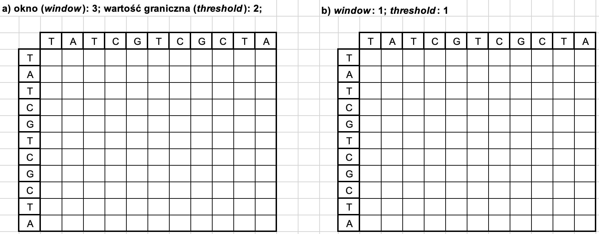
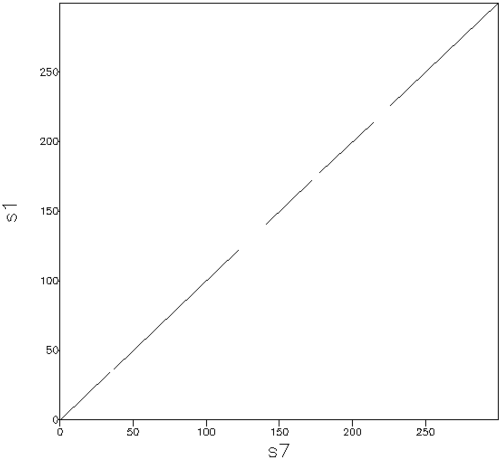
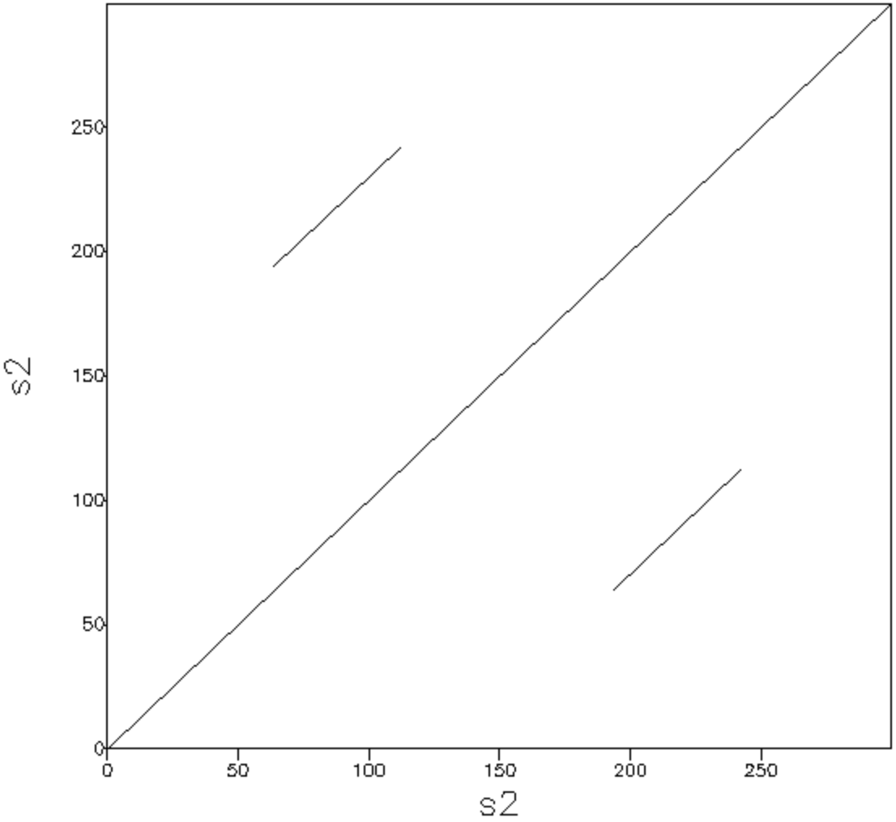
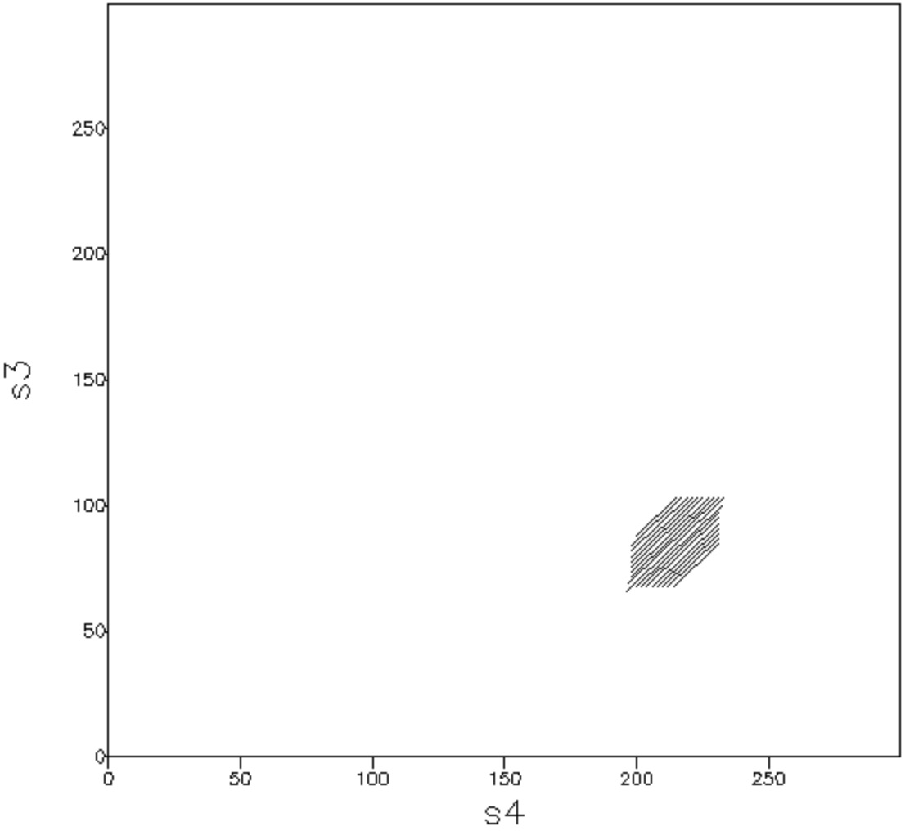
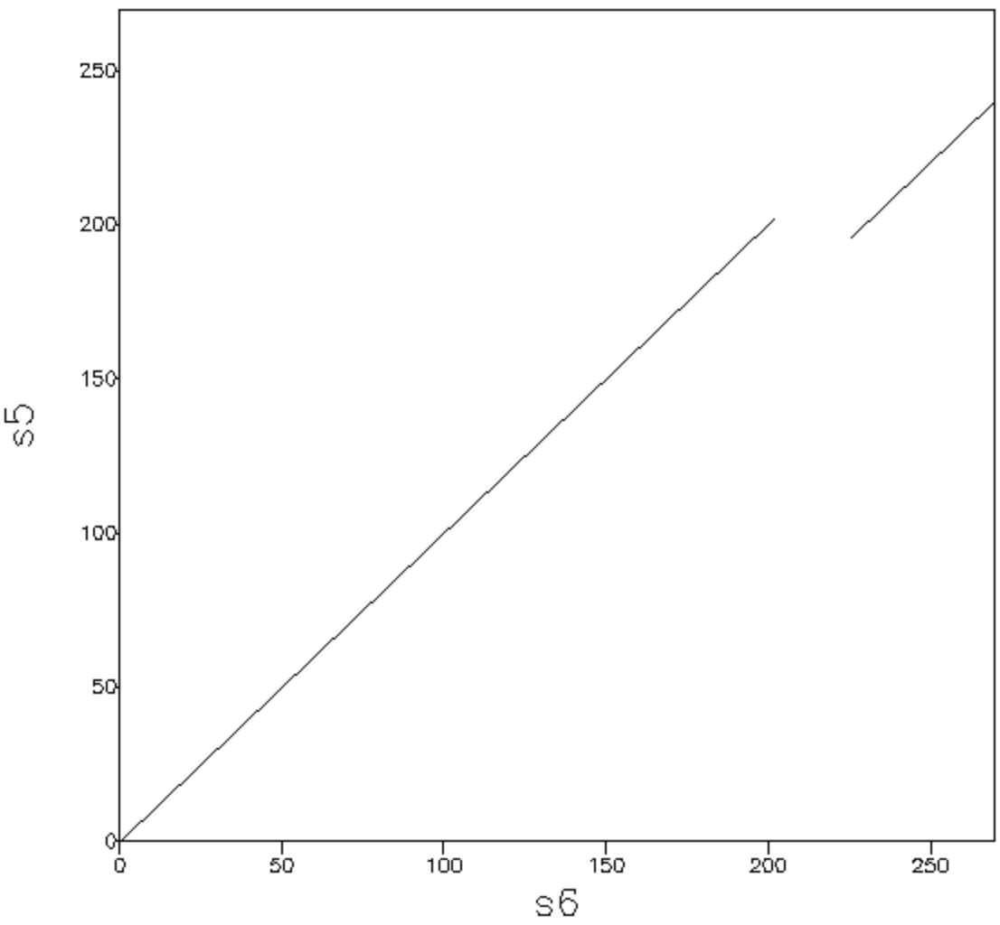
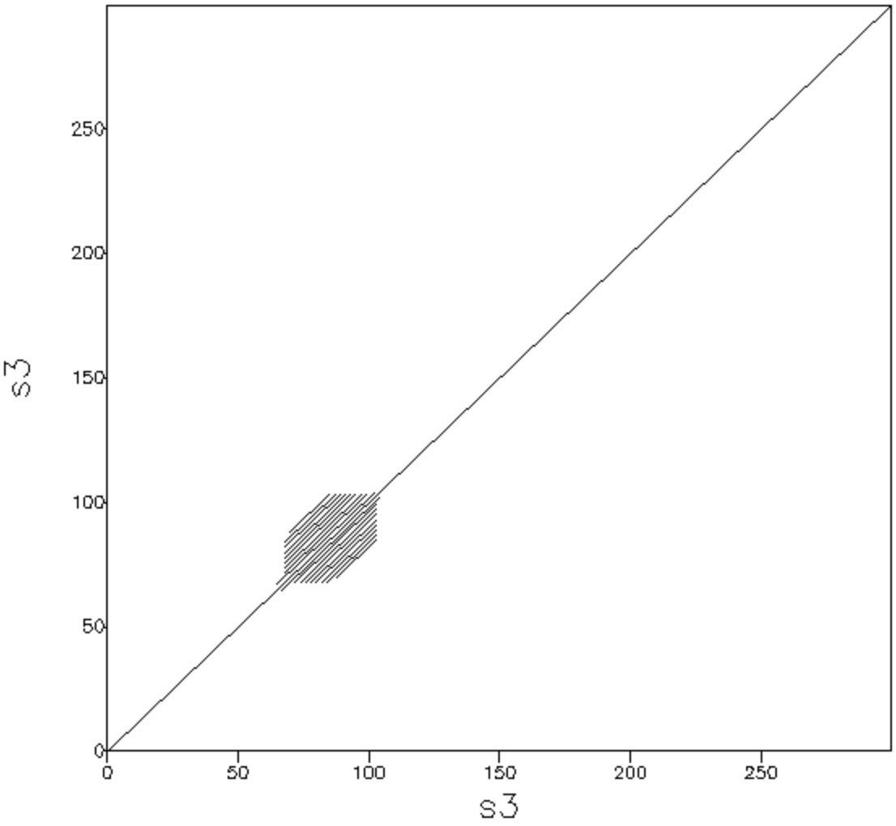
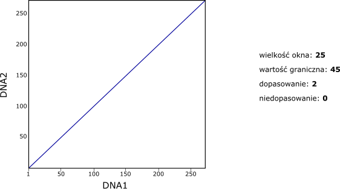
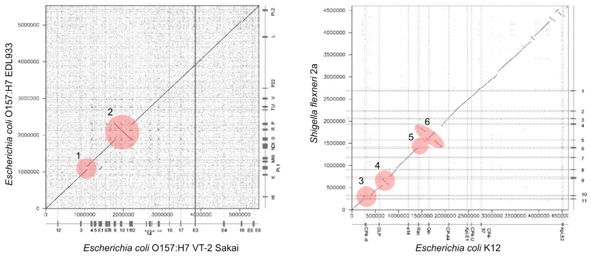

# DotPlot

## Zad. 1
Korzystając z techniki dot-plot porównaj dwie sekwencje DNA wypełniając arkusz [data/dotplot.xlsx](../data/dotplot.xlsx). Wypełniony arkusz dołącz do sprawozdania.



# DotMatcher

## Zad. 2 
W pliku [data/dotplot.fa](../data/dotplot.fa) znajdują się sekwencje nukleotydowe. Otwórz serwis internetowy [dotmatcher](https://www.ebi.ac.uk/jdispatcher/seqstats/emboss_dotmatcher).

Użyj parametrów:
- Rodzaj sekwencji (*Enter a pair of*): `DNA`
- Macierz punktacji (*Matrix*): `DNAfull`
   > W macierzy `DNAfull` za dopasowanie dwóch nukleotydów jest 5 punktów.
- Wielkość okna (*Window Size*): `15`
- Wartość graniczna (*Threshold*): `50`

Utwórz wykresy dot-plot dla poniższych par sekwencji i wskaż prawidłową odpowiedź.

### Para s1:s1


1. Sekwencje są identyczne lub podobne na całej długości
2. Sekwencje są identyczne lub podobne jedynie w kilku fragmentach
3. Sekwencje są do siebie niepodobne
4. Sekwencje zawierają wiele krótkich powtórzonych fragmentów

### Para s1:s7



1. Sekwencje są identyczne lub podobne na całej długości
2. Sekwencje są identyczne lub podobne na całej długości, ale zawierają cztery krótkie regiony niepodobne
3. Sekwencje zawierają wiele powtórzonych fragmentów sekwencji
4. Sekwencje zawierają cztery insercje lub delecje


### Para s2:s2



1. Sekwencje zawierają dwie insercje lub delecje
2. Sekwencje są identyczne lub podobne na całej długości i dodatkowo zawierają powtórzony fragment
3. Sekwencje zawierają kilka fragmentów niepodobnych
4. Sekwencje zawierają wiele fragmentów powtórzonych

### Para s3:s4



1. Sekwencje są identyczne lub podobne na całej długości
2. Sekwencje zawierają wiele insercji lub delecji
3. Sekwencje zawierają wiele krótkich fragmentów powtórzonych ułożonych jeden za drugim
4. Sekwencje s3 i s4 są odwrócone względem siebie

### Para s5:s6



1. W sekwencji s6 nastąpiła insercja lub w sekwencji s5 nastąpiła delecja
2. W sekwencji s6 nastąpiła delecja lub w sekwencji s5 nastąpiła insercja
3. W sekwencji s6 nastąpiła inwersja lub w sekwencji s5 nastąpiła translokacja
4. W sekwencji s6 nastąpiła translokacja lub w sekwencji s5 nastąpiła inwersja

### Para s3:s3



Opisz wykres swoimi słowami.


## Zad. 3
Na poniższym wykresie dotplot porównano dwie sekwencje DNA przy użyciu poniższych parametrów.



Ile wynosi minimalny procent identyczności (dla okna) porównywanych sekwencji? Na przykład, jeżeli w obrębie okna zgadzają się `24` nukleotydy to punktacja wynosi `24 * 2 = 48`, natomiast procent identyczności sekwencji wynosi `24 / 25 * 100 = 96%`.


## Zad. 4
Na poniższej ilustracji przedstawione są wyniki całogenomowych porównań dla DNA dwóch szczepów *Escherichia coli* (lewy panel) oraz dwóch gatunków: *Escherichia coli* i *Shigella flexneri* (prawy panel). Jak zinterpretujesz zaznaczone (1-6) fragmenty wykresów?




## Zad. 5
W pliku [ath_dna.fa](../data/ath_dna.fa) znajduje się sekwencja genomowa zawierająca pewien gen, a w pliku [ath_mrna.fa](../data/ath_mrna.fa) znajduje się sekwencja mRNA tego genu. Korzystając z serwisu [dotmatcher](https://www.ebi.ac.uk/jdispatcher/seqstats/emboss_dotmatcher) i informacji, że najkrótszy egzon analizowanego genu ma długość 72 pz, wykonaj dopasowanie dotplot w taki sposób, aby odpowiedzieć na pytanie: ile egzonów posiada ten gen? Podaj użyte parametry.


## Zad. 6
W serwisie UniProt odszukaj białko kodowane przez gen *UBC* człowieka. Korzystając z serwisu [dotmatcher](https://www.ebi.ac.uk/jdispatcher/seqstats/emboss_dotmatcher) i domyślnych parametrów utwórz wykres dotplot tej sekwencji.

> Program DotMatcher porównuje sekwencje białkowe korzystując z systemu punktacji, który nazywa się [EBLOSUM62](https://ftp.ncbi.nlm.nih.gov/blast/matrices/BLOSUM62). Na przykład, za dopasownie metioniny (M-M) przyznawanych jest 5 punktów, z kolei za niedopasowanie asparaginianu i glutaminianu (D-E) przyznawane są 2 punkty.

1. Podaj number dostępu znalezionego białka UBC.
2. Zinterpretuj uzyskany wykres dotplot.
3. W oparciu o informacje w rekordzie UniProt (w sekcji `Family & Domains`) podaj:
   - Nazwę domeny, która występuje wielokrotnie w tym białku.
   - Długość domeny
   - Sekwencję domeny


## Zad. 7
Zapoznaj się z pomocą zainstalowanego programu (`dotmatcher -h`) i wykonaj analizę z poprzedniego zadania zapisując wykres w formacie pdf. Uzyskany wykres dołącz do sprawozdania.

# Python

## Zad. 8
Utwórz skrypt w Pythonie, który wykona dotplot (wielkość okna = 1, wartość graniczna = 1).


Input:

```python
s1 = 'ACGCAGTA'
s2 = 'ACGGATA'
```

Output:

```
  A C G G A T A
A X . . . X . X
C . X . . . . .
G . . X X . . .
C . X . . . . .
A X . . . X . X
G . . X X . . .
T . . . . . X .
A X . . . X . X
```


## Zad. 9 (dla chętnych)
Zmodyfikuj skrypt z poprzedniego zadania, aby wykonał analizę dotplot dla podanej przez użytkownika wielkości okna i wartości granicznej.