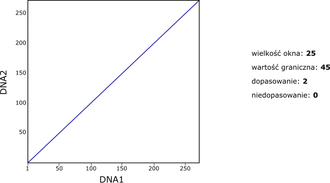
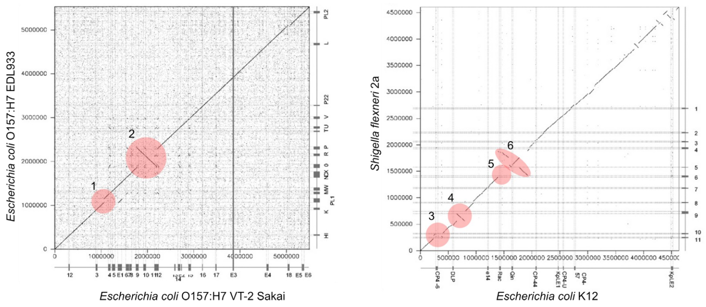

# DotPlot

## Zad. 1
Korzystając z metody dot-plot porównaj dwie sekwencje DNA wypełniając arkusz [
dotplot.xlsx](../data/dotplot.xlsx). Wypełniony arkusz dołącz do sprawozdania.

# DotMatcher

## Zad. 2 
W pliku [dotplot.fa](../data/dotplot.fa) znajdują się sekwencje nukleotydowe. Otwórz serwis internetowy [dotmatcher](https://www.ebi.ac.uk/jdispatcher/seqstats/emboss_dotmatcher).

Użyj parametrów:
- Rodzaj sekwencji (*Sequence type*): `DNA`
- Macierz punktacji (*Matrix*): `DNAfull`

> W macierzy `DNAfull` za dopasowanie (*match*) dwóch nukleotydów jest 5 punktów, a za niedopasowanie (*mismatch*) są -4 punkty.

- Wielkość okna (*Window Size*): `15`
- Wartość graniczna (*Threshold*): `50`

Utwórz wykresy dot-plot dla poniższych par sekwencji, zinterpretuj i opisz uzyskane wyniki:

1. s1:s1
2. s1:s7
3. s2:s2
4. s3:s4
5. s5:s6
6. s3:s3


## Zad. 3
Na poniższym wykresie dotplot porównano dwie sekwencje DNA przy użyciu podanych na wykresie parametrów.



Ile wynosi minimalny procent identyczności (dla okna) porównywanych sekwencji? Na przykład, jeżeli w obrębie okna zgadzają się `24` nukleotydy to punktacja wynosi `24 * 2 = 48`, natomiast procent identyczności sekwencji wynosi `24 / 25 * 100 = 96%`.


## Zad. 4
Na poniższej ilustracji przedstawione są wyniki całogenomowych porównań dla dwóch szczepów *Escherichia coli* (lewy panel) oraz dwóch gatunków: *Escherichia coli* i *Shigella flexneri* (prawy panel). Jak zinterpretujesz zaznaczone (1-6) fragmenty wykresów?




## Zad. 5
W pliku [ath_dna.fa](../data/ath_dna.fa) znajduje się sekwencja genomowa zawierająca pewien gen, a w rekordzie o numerze dostępu NM_113229 znajduje się sekwencja mRNA tego genu. Korzystając z serwisu [dotmatcher](https://www.ebi.ac.uk/jdispatcher/seqstats/emboss_dotmatcher) wykonaj przyrównanie dotplot w taki sposób, aby odpowiedzieć na pytanie: ile egzonów posiada ten gen? Postaraj się zminimalizować niespecyficzne sygnały przy jednoczesnym zachowaniu istotnych informacji. Do protokołu załącz uzyskany wykres dot-plot.


## Zad. 6
W serwisie UniProt odszukaj białko kodowane przez gen *UBC* człowieka. Korzystając z serwisu [dotmatcher](https://www.ebi.ac.uk/jdispatcher/seqstats/emboss_dotmatcher) i domyślnych parametrów utwórz wykres dotplot tej sekwencji.

> Program DotMatcher porównuje sekwencje białkowe korzystając z systemu punktacji, który nazywa się [BLOSUM62](https://ftp.ncbi.nlm.nih.gov/blast/matrices/BLOSUM62). 

1. Podaj numer dostępu znalezionego białka UBC.
2. Zinterpretuj uzyskany wykres dotplot.
3. W oparciu o informacje w rekordzie UniProt podaj:
   - Nazwę domeny, która występuje wielokrotnie w tym białku,
   - Długość domeny w białku oraz
   - Sekwencję domeny.


## Zad. 7
Zapoznaj się z parametrami zainstalowanego w systemie Linux programu `dotmatcher` (`dotmatcher -h`) i wykonaj analizę z poprzedniego zadania zapisując wykres w formacie `pdf`. Polecenie programu `dotmatcher` oraz uzyskany wykres dołącz do sprawozdania.

## Zad. 8
'Spinka' ([stem-loop](https://en.wikipedia.org/wiki/Stem-loop)) to drugorzędowa struktura cząsteczki kwasu nukleinowego, która powstaje na skutek komplementarności sąsiadujących sekwencji . Korzystając z programu `dotmatcher`  przeanalizuj poniższą sekwencję pod kątem możliwości tworzenia 'spinki'.

`ACGTGCCACGATTCAACGTGGCACAG`

Zidentyfikuj i opisz fragmenty sekwencji, które mogą być odpowiedzialne za tworzenie struktury drugorzędowej (regiony niesparowane, sparowane oraz pętlę). Do protokołu załącz wykres dotplot.

# Python

## Zad. 9
Utwórz skrypt w Pythonie, który wykona dotplot (wielkość okna = 1, wartość graniczna = 1).


Input:

```python
s1 = 'ACGCAGTA'
s2 = 'ACGGATA'
```

Output:

```
  A C G G A T A
A X . . . X . X
C . X . . . . .
G . . X X . . .
C . X . . . . .
A X . . . X . X
G . . X X . . .
T . . . . . X .
A X . . . X . X
```


## Zad. 10 (*dodatkowe*)
Zmodyfikuj skrypt z poprzedniego zadania, aby wykonał analizę dotplot dla podanej przez użytkownika wielkości okna i wartości granicznej.