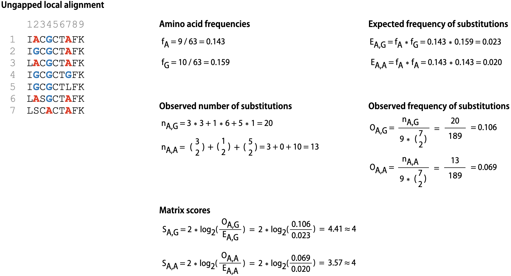

## Zad. 1
Oblicz macierz substytucji aminokwasowych na podstawie 50 bloków sekwencji ([data/blocks.zip](../data/blocks.zip)). 

Output:

```
   A  C  D  E  F  G  H  I  K  L  M  N  P  R  S  T  Q  W  Y  V
A  5  1  0  2  1  1  0  1  1  1  0  0  2  0  3  2  2 -3  0  2
C  1  3 -4 -3 -2 -4 -3 -2 -4 -1  0 -3 -1 -4 -1 -3 -2 -3 -2  0
D  0 -4  7  3 -4  0  0 -4  0 -2 -3  2  2  0  0  0  1 -3 -3 -3
E  2 -3  3  5 -1 -1  2  0  3  1  0  1  1  3  1  1  4 -2 -1  0
F  1 -2 -4 -1  4 -3  2  0 -2  2  2  0 -1  1 -1 -1 -1  3  4  1
G  1 -4  0 -1 -3  6 -1 -4  0 -3 -3  1  1 -2  0 -1  1 -4 -4 -4
H  0 -3  0  2  2 -1  7  1  1  1  3  3 -1  1  1  1  2  3  3 -1
I  1 -2 -4  0  0 -4  1  6 -2  3  2 -3 -2  0 -1  0  0  0  2  5
K  1 -4  0  3 -2  0  1 -2  5  0  1  1  1  3  0  1  3 -4  0 -1
L  1 -1 -2  1  2 -3  1  3  0  5  3 -1 -1  0 -2  0  1  0  2  3
M  0  0 -3  0  2 -3  3  2  1  3  9  1 -4  0 -2  0  1 -1  0  2
N  0 -3  2  1  0  1  3 -3  1 -1  1  5  1  1  1  1  2 -3  0 -1
P  2 -1  2  1 -1  1 -1 -2  1 -1 -4  1  7 -1  1  0  0 -4 -2 -1
R  0 -4  0  3  1 -2  1  0  3  0  0  1 -1  6 -1  1  3 -3 -2 -2
S  3 -1  0  1 -1  0  1 -1  0 -2 -2  1  1 -1  5  3  1 -3  0  0
T  2 -3  0  1 -1 -1  1  0  1  0  0  1  0  1  3  5  1 -3 -1  1
Q  2 -2  1  4 -1  1  2  0  3  1  1  2  0  3  1  1  4  0  0  0
W -3 -3 -3 -2  3 -4  3  0 -4  0 -1 -3 -4 -3 -3 -3  0  7  4  0
Y  0 -2 -3 -1  4 -4  3  2  0  2  0  0 -2 -2  0 -1  0  4  6  1
V  2  0 -3  0  1 -4 -1  5 -1  3  2 -1 -1 -2  0  1  0  0  1  5
```

Punkty kontrolne:

<pre>
# Amino acid frequencies
f<sub>A</sub> = 23014 / 230513 = 0.099838                      
f<sub>G</sub> = 17499 / 230513 = 0.075913

# Expected frequency of substitutions
E<sub>A,G</sub> = f<sub>A</sub> * f<sub>G</sub> = 0.007579 
E<sub>A,A</sub> = f<sub>A</sub> * f<sub>A</sub> = 0.009968

# Observed number of substitutions
n<sub>A,G</sub> = 619004
n<sub>A,A</sub> = 3143277

# Observed frequency of substitutions
O<sub>A,G</sub> = n<sub>A,G</sub> / 52387931 = 0.0118158
O<sub>A,A</sub> = n<sub>A,A</sub> / 52387931 = 0.0600000

# Matrix scores
S<sub>A,G</sub> = 2 * log2(O<sub>A,G</sub>/E<sub>A,G</sub>) = 1.281252 ≈ 1
S<sub>A,A</sub> = 2 * log2(O<sub>A,A</sub>/E<sub>A,A</sub>) = 5.179271 ≈ 5
</pre>

