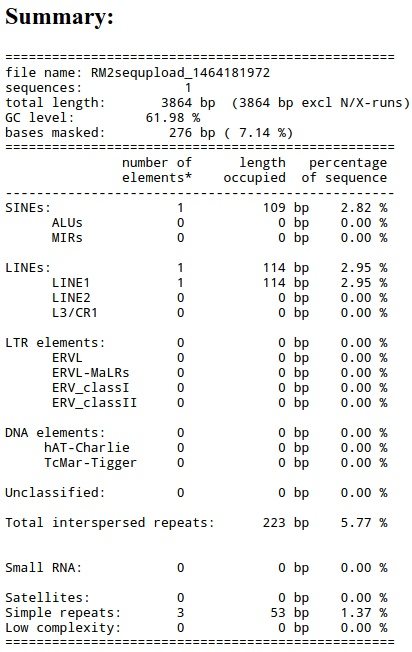
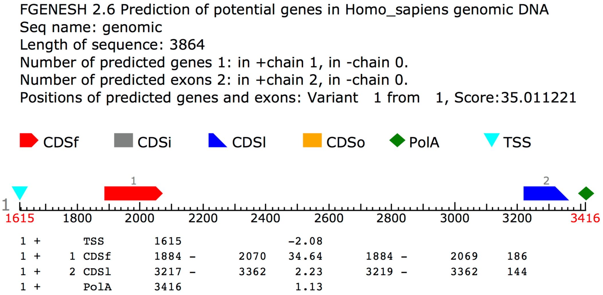
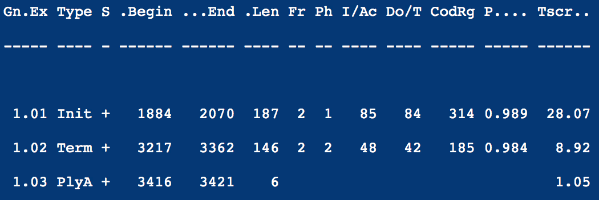
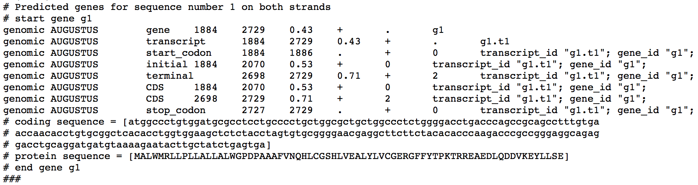

> Celem ćwiczeń jest zidentyfikowanie potencjalnych genów i elementów powtarzalnych we fragmecie genomowej sekwencji człowieka: [data/genomic.fasta](../data/genomic.fasta)

# Identyfikacja elementów powtarzalnych

## Zad. 1

* Wejdź na stronę serwisu RepeatMasker (<a target="_blank" href="http://www.repeatmasker.org">http://www.repeatmasker.org</a>).
* Z menu po lewej stronie wybierz serwis `RepeatMasking`
* W polu `Sequence` umieść wejściową sekwencję genomową ([genomic.fasta](../data/genomic.fasta))
* W polu `DNA source` wybierz genom człowieka.
* W zaawansowanych ustawieniach (`Advanced Options`) wybierz:
   * `Masking options` > `Repetitive sequences in lower case`.
* Zatwierdź przycikiem `Submit sequence`.

> Wskazówka: W interpretacji wyników może przydać się pomoc RepeatMasker'a (http://www.repeatmasker.org/webrepeatmaskerhelp.html).

1. Ile wynosi procentowy udział wszystkich zidentyfikowanych sekwencji powtarzalnych, które zostały zamaskowane?
2. Wypisz nazwy elementów powtarzalnych, które zostały zidentyfikowane w sekwencji.
3. Do jakiego typu elementów powtarzalnych należą sekwencje SINE i LINE?
    - retrotranspozonów zawierających sekwencje LTR
    - retrotranspozonów niezawierających sekwencji LTR 
    - prostych powtórzeń
    - regionów o niskiej złożoności nukleotydowej

Otwórz szczegółowe wynki adnotacji w wersji tekstowej(`Annotation file`).

4. Wypisz sekwencje znalezionych prostych powtórzeń (`Simple repeats`).
5. Podaj miejsce początku i końca elementu LINE w sekwencji zapytania.

Wróć do strony z wynikami programu RepeatMasker. Otwórz szczegółowy raport przyrównania sekwencji zapytania ze znalezionymi sekwencjami elementów powtarzalnych  (`Alignment file`).

6. Co oznaczają litery `i`, `v` w dopasowaniach? *Wskazówka:* [pomoc RepeatMasker'a](http://www.repeatmasker.org/webrepeatmaskerhelp.html).

Wróć do strony z wynikami programu RepeatMasker. Otwórz wynikową sekwencję genomową (plik `.masked`). 

7. W jaki sposób sekwencje elementów powtarzalnych zostały zaznaczone (zamaskowane) w sekwencji?

8. Uruchom ponownie program RepeatMasker. Tym razem w opcjach maskowania (`Masking options`) wybierz `Repetetive sequences replaced by string of N`. Na czym polega różnica między maskowaniem sekwencji małymi literami a ciągami `N` znaków?

9. Zapisz zamaskowaną sekwencję genomową (z ciągami `N` znaków ) na dysku do pliku `genomic_masked.fasta`.

# Przewidywanie genów *ab initio*

## Zad. 2

* Otwórz program FGENESH (<a href="http://www.softberry.com">www.softberry.com</a> > `Run Programs Online` > `Gene Finding in Eukaryota` > `FGENESH`) 
* Wklej zamaskowaną sekwencję genomową (`genomic_masked.fasta`).
* Wybierz odpowiedni organizm (*human*).
* Zatwierdź przyciskiem `Search`.

> Wskazówka: W uzyskaniu odpowiedzi na poniższe pytania przydatna będzie strona pomocy FGENESH: http://www.softberry.com/berry.phtml?topic=fgenesh&group=help&subgroup=gfind

1. Ile potencjalnych genów zostało zidentyfikowanych w tej sekwencji?
2. Wyjaśnij pojęcie TSS.
3. Wyjaśnij pojęcie PolA.
4. Z ilu egzonów składa się przewidziany gen?
5. Na której nici DNA został zidentyfikowany gen?
6. Wypisz wszystkie zidentyfikowane elementy genu wraz z ich lokalizacją w sekwencji genomowej.
7. Z ilu aminokwasów składa się białko kodowane przez przewidziany gen?
8. Umieść sekwencję białka kodowanego przez przewidziany gen w formacie FASTA.

## Zad. 3

Otwórz program GENSCAN (http://hollywood.mit.edu/GENSCAN.html). W polu sekwencji wklej zamaskowaną sekwencję genomową (bez nagłówka FASTA), a także wybierz odpowiedni organizm. Zatwierdź przyciskiem `Run GENSCAN`.

1. Podaj nazwy i lokalizację wszystkich zidentyfikowanych przez GENSCAN elementów struktury genu.
2. Wskaż różnicę w wynikach przewidywań programu GENSCAN i FGENESH.

## Zad. 4
Otwórz program Augustus (http://bioinf.uni-greifswald.de/augustus/submission.php). W polu sekwencji wklej zamaskowaną sekwencję genomową, a także wybierz odpowiedni organizm. Zatwierdź przyciskiem `Run AUGUSTUS`.

> Wskazówka: Informacje o opcjach i sposobie działania programu znajdziesz tutaj:http://bioinf.uni-greifswald.de/augustus/help

1. Czym różnią się uzyskane predykcje od wyników FGENESH i GENSCAN?
2. Podaj nazwy i lokalizację wszystkich zidentyfikowanych elementów struktury genu.
3. Podaj elementy struktury genów przewidziane przez wszystkie programy (FGENESH, GENSCAN, Augustus). 

# Analiza sekwencji EST

## Zad. 5

#### 5.1. Wyszukiwanie sekwencji EST

Korzystając z NCBI Nucleotide BLAST przeszukaj bazę `Expressed sequence tags (est)` u człowieka, wykorzystując zamaskowaną sekwencję genomową jako zapytanie. 

W wynikach programu BLAST, W zakładce `Descriptions` zaznacz tylko najbardziej podobne dopasowania sekwencji EST (E-value = 0.0).
> Wskazówka: Możesz szybko zaznaczyć sekwencje EST poprzez zaznaczanie kratki przy pierwszym dopasowaniu oraz zaznaczenie z wciśniętym SHIFT ostatniej kratki którą chcesz zaznaczyć.

1. Ile takich sekwencji zostało znalezionych?
2. O czym świadczy istnienie sekwencji EST dla danego rejonu sekwencji genomowej?

Zapisz zaznaczone sekwencje (`Download` > `Fasta (complete sequences)`) i nazwij plik `est.fasta`.

#### 5.2. Składanie sekwencji EST

W celu złożenia krótkich nakładających się sekwencji EST w dłuższe sekwencje kontigowe (*contigs*) użyj programu CAP3 (<a href="http://doua.prabi.fr/software/cap3">http://doua.prabi.fr/software/cap3</a>). W polu sekwencji umieść pobrane sekwencje EST i naciśnij przycisk `Submit`.

Otwórz wyniki `Contigs`. 

1. Ile złożonych sekwencji uzyskano? Zapisz każdą z nich w osobnym pliku.

Otwórz szczegóły złożenia (`Assembly details`). 

2. Która sekwencja kontigowa składa się z większej liczby sekwencji EST?

Otwórz wyniki `Single sequences`.

3. Czy jakieś sekwencje nie zostały uwzględnione w złożeniu?

#### 5.3. Mapowanie sekwencji kontigowych do genomu

W celu zmapowania sekwencji contigów do sekwencji genomowej `genomic_masked.fasta` użyj programu [FuzzyFinder](https://users.soe.ucsc.edu/~kent/fuzzyFind/fuzzyFind.html). Wykorzystaj opcje: strand - both; match - cDNA. Wykonaj osobno przyrównanie każdego contigu do sekwencji genomowej i zapisz ich lokalizację w sekwencji DNA.

1. Czy lokalizacje contigów pokrywają się z predykcjami sekwencji kodujących (CDS) programów przewidywania *ab initio*?
2. O czym może świadczyć istnienie więcej niż jednego contigu?

# Wyszukiwanie sekwencji homologicznych

## Zad. 6
Korzystając z serwisu NCBI Protein BLAST sprawdź, czy w bazie **RefSeq** (`Reference proteins (refseq_protein)` znajdują się sekwencje **człowieka** podobne do sekwencji aminokwasowej przewidzianej przez program FGENESH.

1. Jak nazywa się gen, który przewidział(e/a)ś?
2. W oparciu o wyniki BLAST sprawdź, czy przewidziana sekwencja białkowa została poprawnie wyznaczona?

# Domeny białkowe

## Zad. 7
W celu identyfikacji domen białkowych występujących w sekwencji białkowej przewidzianej przez program FGENESH użyj narzędzia InterPro (<a href="https://www.ebi.ac.uk/interpro/">https://www.ebi.ac.uk/interpro/</a>) [`Search` > `By Sequence`].

1. Jaka domena (rodzina białkowa) została zidentyfikowana w tym białku?

Otwórz rekord znalezionej rodziny białkowej.

2. Ile sekwencji zidentyfikowanych w bazie InterPro należy do tej rodziny?
3. W ilu organizmach ją zidentyfikowano (`Taxonomy`)?
4. Czy domena ta występuje w sekwencjach innych niż kręgowce?