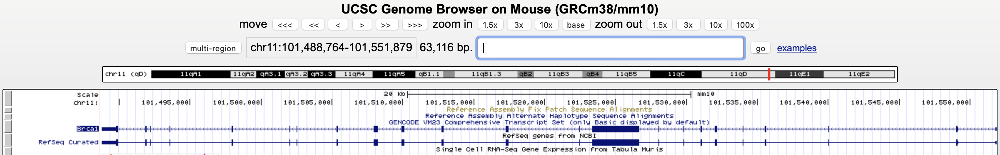
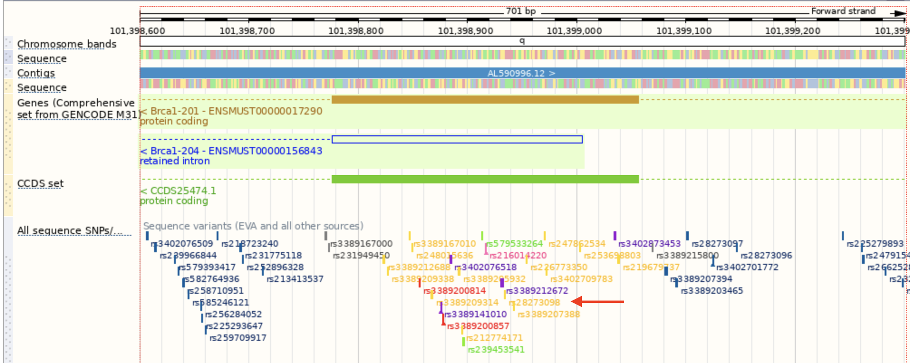

## Zad. 1
> Zadanie ma na celu sprawdzenie jaki wpływ na sekwencję białka mają mutacje w genie myszy, Brca1 (*Breast cancer type 1 susceptibility*). 

* Otwórz UCSC Genome Browser (<a href="http://genome.ucsc.edu/">http://genome.ucsc.edu/</a>).
* Zresetuj wszystkie ustawienia (`Genome Browser` > `Reset All User Settings`).
* Z zakładki `Genomes` wybierz genom myszy (`Mouse GRCm38/mm10`).
* Wyszukaj gen `Brca1` (użyj podpowiedzi wyświetlanych podczas wpisywania).

1. Podaj lokalizację genomową tego genu (chromosom, pozycja startu i końca).
2. Z ilu egzonów składa się ten gen?
3. Z ilu intronów składa się ten gen?
4. Na której nici DNA znajduje się ten gen (`+`/`-`)?

* Na dole strony w sekcji `Variation and Repeats` kliknij na link `Common SNPs(142)`. Zmień następujące opcje:
  * Ustaw tryb wyświetlania ścieżki (`Display mode`) na `pack`
  * Z opcji kolorowania wybierz: 
     - `SNP Feature for Color Specification`: *Function*.
     - `coding-nonsynonymous`: `blue`, pozostałe typy: `black`.
  * Zatwierdź zmiany przyciskiem `Submit`.

5. Czy na mapie genomu wyświetlone są substytucje *SNP Coding-Nonsynonymous*?
6. Co oznacza określenie *Coding-NonSynonymous substitution*?
7. Wyjaśnij pojęcie SNP.

* Wybierz pierwszy od lewej zaznaczony niebieskim kolorem SNP (`rs28273098`) klikając na jego nazwę. 

8. W jakiej pozycji genomu występuje analizowana zmiana SNP?
9. Jaka zmiana aminokwasu jest powiązana z tym SNP? (`Coding annotations by dbSNP`)
10. Jakiej zmiany nukleotydu dotyczy ten SNP?
11. Wróc do widoku przeglądarki genomowej. Poeksperymentuj z poruszaniem się w przeglądarce. Spróbuj za pomocą myszki poprzesuwać widok w prawo i w lewo łapiąc za obraz. Co się stanie, gdy dodatkowo wciśniesz `Ctrl` lub `Shift`?

## Zad. 2
> Zadanie ma na celu wyświetlenie mysiego genu BRCA1 w przeglądarce genomowej Ensembl.

* Otwórz stronę serwisu Ensembl (<a href="http://www.ensembl.org/">http://www.ensembl.org/</a>).
* Wybierz genom myszy.
* Wyszukaj gen BRCA1 (`ENSMUSG00000017146`).
* Z karty genu przejdź do jego lokalizacji (zakładka `Location`).
* Włącz wyświetlanie ścieżki `Sequence variants` (z menu po lewej wybierz `Configure this page`, następnie grupę `Variation`, zaznacz ścieżkę `Sequence variants (EVA and all other sources)`, wyświetloną w stylu `expanded with name`. Zmiany zatwierdź przyciskiem w prawym górnym rogu (`Save and close`).
 
* Znajdź ten sam SNP co w zadaniu 1 (SNP `rs28273098`). Zauważ, że nazwy SNP wyświetlane będą jeżeli okno widoku obejmować będzie mnie niż 10 kb sekwencji.

1. Jakim kolorem oznaczony jest znaleziony SNP (`rs28273098`)?
2. Podaj nazwę przykładowego SNP, który występuje w egzonie i nie wywołuje zmiany aminokwasu.
3. Co oznacza polimorfizm typu `stop gained` i `frameshift variant`?

## Zad. 3
> Zadanie ma na celu wskazanie lokalizacji promotora ludzkiego genu NRAS (neuroblastoma RAS viral (v-ras) oncogene homolog).

* Otwórz stronę serwisu UCSC Genome Browser.
* Zresetuj wszystkie ustawienia (`Genome Browser` > `Reset all user settings`).
* Znajdź w genomie człowieka (`GrCh37/hg19`) gen `NRAS`.
* Zwiększ wyświetlany obszar o 1000 par zasad z obu stron genu.
* Wśród listy dostępnych ścieżek, w grupie `Regulation` wejdź w `TFBS Conserved`.
    - Ustaw sposób wyświetlania ścieżki na `full` i naciśnij `Submit`.

1. Na jakiej nici DNA znajduje się gen NRAS?
2. Wyświetl szczegółowe informacje dotyczące czynnika transkrypcyjnego `V$CDC5_01` klikając na jego nazwę. Użyj jego identyfikatora SwissProt aby dowiedzieć się o jego funkcji w bazie UniProt. Opisz znalezioną funkcję.

## Zad. 4
Na stronie serwisu Ensembl (<a href="http://www.ensembl.org/">http://www.ensembl.org/</a>) wybierz genom muszki owocowej (*Drosophila melanogaster*). Następnie pobierz plik z adnotacjami (`Download GTF` > `Drosophila_melanogaster.BDGP6.46.111.gtf.gz`) i rozpakuj go. 

Napisz program w Pythonie, który przedstawi następujące informacje:

1. Trzy geny o najdłuższej sekwencji genomowej. 
   - Dla każdego genu podaj jego `gene_id`, `gene_name` i długość sekwencji.
2. Trzy geny o największej liczbie transkryptów. 
   - Dla każdego genu podaj jego `gene_id`, `gene_name` i liczbę transkryptów.

Na koniec uruchom swój program dla pliku GTF człowieka i umieść w sprawodzaniu uzyskane statystyki.
