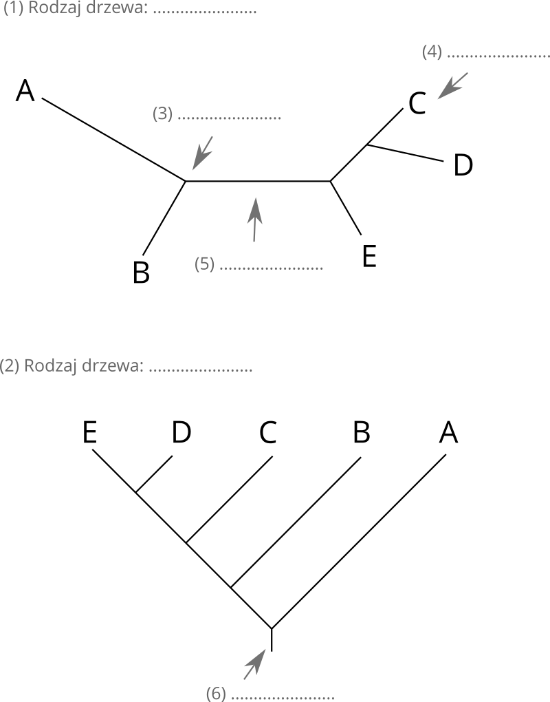
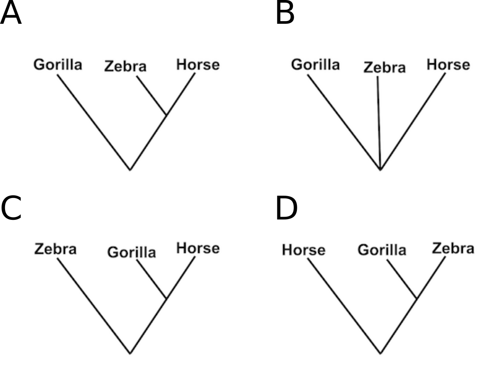
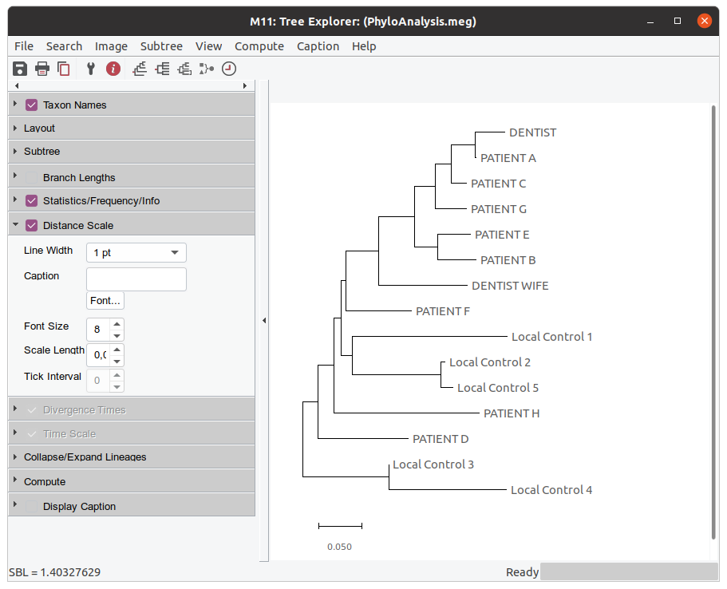
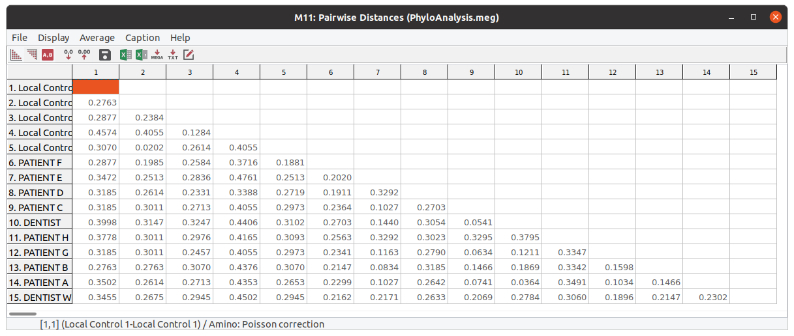

# Podstawowe pojęcia z filogenetyki

## Zad. 1

1. Podpisz rysunek (rodzaj drzewa i co jest na nim zaznaczone)

<p align="center"></p>

2. Na czym polega różnica w interpretacji między drzewem nieukorzenionym a ukorzenionym?

## Zad. 2

Przedstawione poniżej drzewo nieukorzenione można przekształcić w 5 drzew ukorzenionych w zależności od miejsca lokalizacji korzenia (miejsca te są zaznaczone cyframi).


```
D                  C
 \                /
  \4            3/
   \____________/
   /      5     \
  /1            2\
 A                \
                   B
```

Przykład takiego drzewa, w którym korzeń umieszczony jest przy odgałęzieniu 1 przedstawiony jest poniżej:

```
C    B   D   A 
 \  /   /   /
  \/   /   /
   \  /   /
    \/   /
     \  /
      \/
       |
       1   
```

1. Narysuj pozostałe możliwości drzew ukorzenionych (umieszczając korzeń w 2, 3, 4, 5).

#### Przestrzenie drzew

Liczba możliwych drzew dla różnej liczby sekwencji.

```
Liczba sek. (N)   Drzewa nieukorzenione   Drzewa ukorzenione
5                 15                      105
6                 105                     945
7                 945                     10 395
8                 10 395                  135 135
N                 (2N - 5)!!              (2N - 3)!!
```

Na przykład, dla 9 sekwencji (*N* = 9) liczba możliwych drzew nieukorzenionych jest równa:

```
(18 - 5)!! = 13!! = 1 * 3 * 5 * 7 * 9 * 11 * 13 = 135 135
```

2. Ile istnieje drzew nieukorzenionych i ukorzenionych dla 10 sekwencji?


## Zad. 3
Poniższe drzewa są nieukorzenione, a długości ich gałęzi nie odpowiadają odległości ewolucyjnej. Które drzewa są ze sobą równoważne?

<p align="center"></p>


## Zad. 4
Poniższa tabela przedstawia cztery aminokwasy wśród trzech gatunków.

````
Gorilla   Lys - Glu - His - Lys
Horse     Arg - Lys - His - Lys
Zebra     Arg - Lys - His - Lys
````

Które drzewo najodpowiedniej opisuje relację między powyższymi gatunkami.

<p align="center"></p>


# MEGA
Program MEGA (*Molecular Evolutionary Genetic Analysis*) jest zainstalowany na komputerach w sali ćwiczeniowej S2. Strona programu: [https://www.megasoftware.net](https://www.megasoftware.net).


## Zad. 5
W latach 90’ u ośmiu pacjentów dentysty z Florydy chorego na AIDS zdiagnozowano wirus HIV (HIV+). Mimo, że dentysta przeprowadzał inwazyjne procedury dentystyczne (np. leczenie kanałowe, ekstrakcja zębów), śledztwo przeprowadzone przez amerykańską agencję epidemiologiczną nie wykazało istotnych uchybień w postępowaniu zapewniającym bezpieczeństwo i higienę wykonywanych zabiegów.

W celu ustalenia źródła zakażenia wirusem HIV, wyizolowałeś/aś wirusowe RNA z próbek krwi należących do: 

* dentysty, 
* żony dentysty chorej na AIDS, 
* pacjentów dentysty chorych na AIDS oraz 
* innych osób z okolicy Florydy zakażonych wirusem HIV, którzy nie mieli kontaktu z dentystą (*local group*). 

Sekwencje wirusowego białka gp120, które otrzymałeś, znajdują się w pliku [HIV_data_set.fasta](../data/HIV_data_set.fasta).

---

#### 5.1 Dopasowanie sekwencji

* Otwórz program MEGA zainstalowany na lokalnym komputerze.
* Otwórz w programie sekwencje znajdujące się w pliku `HIV_data_set.fasta`.
   * `Align` > `Edit/Build Alignment` > `Retrieve sequences from a file`.
* Zaznacz wszystkie sekwencje (Ctrl+A lub `Edit` > `Select all`) i przeprowadź ich dopasowanie (`Alignment` > `Align by ClustalW`) korzystając z domyślnych ustawień.


1. Jaka jest długość dopasowania?
   - Wskazówka: Kliknij na ostatnią kolumnę dopasowania sekwencji i spójrz na numer kolumny w lewym dolnym rogu okna (`Site #`).
2. Ile jest pozycji w dopasowaniu, w których aminokwas zachowany jest we wszystkich sekwencjach?


#### 5.2 Analiza filogenetyczna

* W oknie dopasowania sekwencji wybierz z menu wybierz `Data` > `Phylogenetic Analysis`.
* W głównym oknie programu MEGA wygeneruj drzewo używając algorytmu *Neighbor-Joining (NJ)* 
   * `Analysis` > `Phylogeny` > `Construct/Test Neighbor-Joining tree`.
* W opcjach `Test of Phylogeny` ustaw `None`.
* Naciśnij przycisk `Compute`.



3. Czy uważasz, że dentysta z Florydy mógł zakazić któregokolwiek z ośmiu pacjentów?
4. W jakim celu pobrano materiał genetyczny od osób zarażonych HIV nie mających kontaktu z dentystą (`Local Controls`)?


#### 5.3 Formatowanie i ukorzenianie drzewa

Wyświetl drzewo w formie kladogramu (ikona `Topology only`).

5. Jaka jest różnica pomiędzy filogramem, a kladogramem?

Wyświetl drzewo w różnych stylach (`View` > `Tree/Branch Style`).

Wróć do prostokątnego widoku drzewa. Zmodyfikuj tak drzewo żeby jego korzeniem była gałąź prowadząca do białka gp120 Dentysty (naciśnij prawym przyckiskiem gałąź prowadzącą do liścia `DENTIST` i wybierz `Root Tree`).

Ukryj klad obejmujący liście `Local Control 1-5` (naciśnij prawym przyciskiem na gałąź prowadzącą do tego kladu i wybierz `Compress/Expand Subtree`).

#### 5.4 Macierz dystansów

Oblicz odległości w dopasowaniu par sekwencji analizowanych białek gp120 [główne okno programu > `Analysis` > `Distance` > `Compute Pairwise`].



6. Która para białek gp120 jest najbliżej, a która najdalej spokrewniona?


## Zad. 6
W programie MEGA przeprowadź analizę filogenetyczną sekwencji 12s rRNA (niekodujące białka) znajdujących się w pliku [bears.fasta](../data/bears.fasta). Sekwencje pochodzą z 7 gatunków niedźwiedzi i 4 gatunków innych kręgowców.

```
1. Niedźwiedź czarny
2. Niedźwiedź brunatny
3. Niedźwiedź himalajski
4. Andoniedźwiedź okularowy
5. Niedźwiedź polarny
6. Panda wielka
7. Pandka ruda
8. Pies
9. Szop pracz
10. Scynk krokodylowy
11. Krowa
```

1. Wymień dwie "pary niedźwiedzi", które są ze sobą najbardziej spokrewnione?
2. Które niedźwiedzie są ze sobą bardziej spokrewnione: 
   * Niedźwiedź himalajski - Niedźwiedź czarny 
   * Niedźwiedź czarny - Niedźwiedź brunatny?

Ustaw korzeń drzewa na gałąź `Crocodillian skink (outgroup)`, wyświetl drzewo w pełnej wielkości okna (lewy panel `Layout` - `Autosize the tree`) i wyświetl długości gałęzi (lewy panel `Branch lengths`).

3. Czy pandka ruda jest w ogóle niedźwiedziem?
4. Które niedźwiedzie są najstarsze?
5. Zapisz drzewo jako obrazek do pliku PNG.


## Zad. 7
Sekwencje z poprzedniego zadania należą do żyjących gatunków niedźwiedzi. Niedźwiedź jaskiniowy (*Ursus spelaeus*) wymarł ok. 20 tys. lat temu. Wybierz dowolną sekwencję 12s rRNA z pliku `bears.fasta`, użyj jej jako sekwencji zapytania w programie BLAST i zidentyfikuj sekwencję 12s rRNA niedźwiedzia jaskiniowego. W wynikach programu BLAST otwórz rekord znalezionej sekwencji, następnie wyszukaj w rekordzie `/gene="12S rRNA"` i wyświetl sekwencje tego genu w formacie FASTA. Następnie znalezioną sekwencję dołącz do sekwencji pozostałych gatunków w pliku `bears.fasta` i zbuduj drzewo filogenetyczne.

1. Który niedźwiedź jest najbliższym krewnym wymarłego niedźwiedzia jaskiniowego?
2. Czy dołączenie niedźwiedzia jaskiniowego zmieniło układ pozostałych taksonów na drzewie?


## Zad. 8
Utwórz drzewo sekwencji niedźwiedzi z poprzedniego zadania korzystając z algorytmu Neighbor-Joining i zaznaczając `Test of Phylogeny`: `Bootstrap method` (No. of Boostrap Replications): `1000`.

1. Co oznaczają liczby znajdujące się na węzłach uzyskanego drzewa?
2. Czy na drzewie znajdują się grupy sekwencji o niskim poziomie ufności?
3. Które rozgałęzienia na drzewie są najbardziej wiarygodne.
4. Obejrzyj drzewo w zakładce `Bootstrap tree`. Czy układ organizmów na drzewach `Original Tree` i `Bootstrap Tree` jest taki sam?